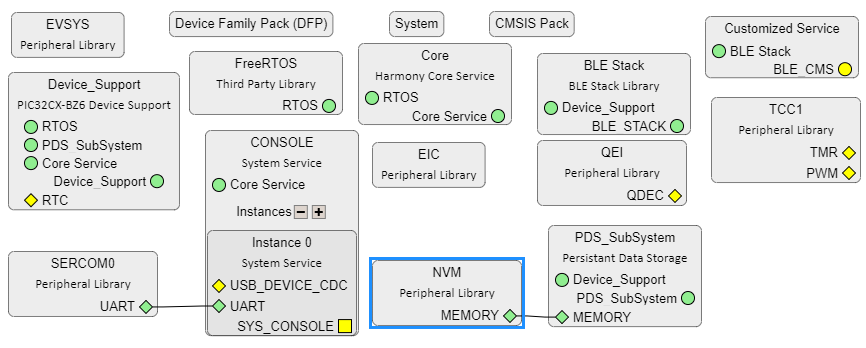
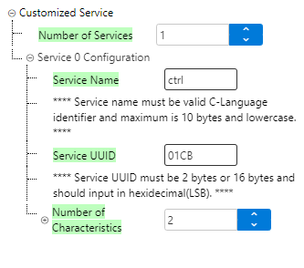
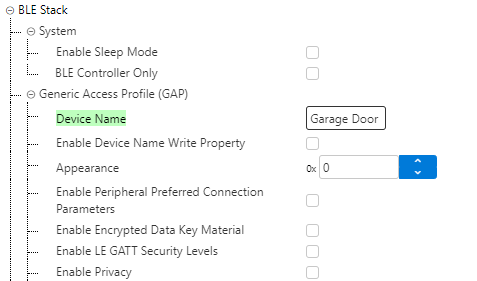
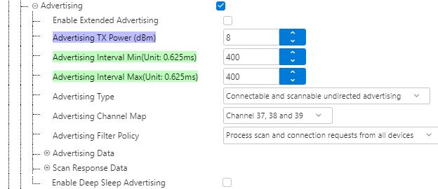
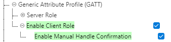
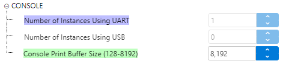
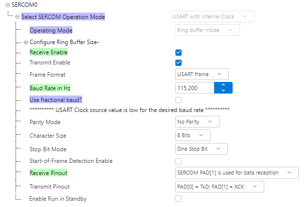
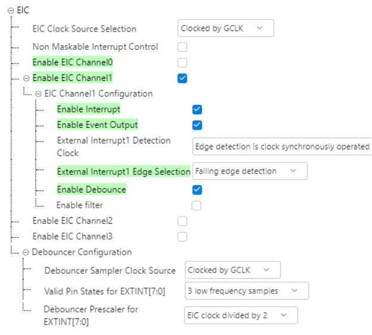
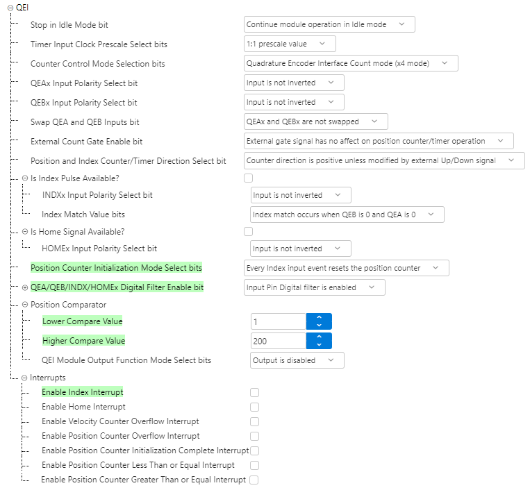

# PIC32BZ6 Bluetooth LE DC MOTOR CONTROL

> "IoT Made Easy!"

Devices: **| PIC32CX2051BZ62132 | PIC32WM-BZ6204UE | PIC32-BZ6 |** 
Features: **| BLE | Motor Control |**

## ⚠ Disclaimer

<b>
THE SOFTWARE ARE PROVIDED "AS IS" AND GIVE A PATH FOR SELF-SUPPORT AND SELF-MAINTENANCE. This repository contains example code intended to help accelerate client product development.  

For additional Microchip repos, see: <a href="https://github.com/Microchip-MPLAB-Harmony" target="_blank">https://github.com/Microchip-MPLAB-Harmony</a>

Checkout the <a href="https://microchipsupport.force.com/s/" target="_blank">Technical support portal</a> to access our knowledge base, community forums or submit support ticket requests.

</b>

## Contents

1. [Introduction](#step1)
2. [Bill of materials](#step2)
3. [Hardware Setup](#step3)
4. [Software Setup](#step4)
5. [Harmony MCC Configuration](#step5)
6. [Board Programming](#step6)

## 1. Introduction<a name="step1">

This application allows users to control a Brushed DC Motor over Bluetooth® Low Energy (BLE) using the PIC32-BZ6 Curiosity Board. The motor’s on/off state and speed can be controlled through a mobile app, while the velocity is continuously reported back to the app.

## 2. Bill of materials<a name="step2">

| TOOLS | QUANTITY |
| :- | :- |
| [PIC32CX-BZ2 and WBZ451 Curiosity Development Board](https://www.microchip.com/en-us/development-tool/ev31u42a) | 1 |
| [Encoder Metal Gearmotor 24V DC High Speed 600RPM](https://a.co/d/azyOtP7) | 1 |
| [DROK DC Motor Driver, L298 Dual H Bridge Motor Speed Controller](https://a.co/d/4akP0QY) | 1 |

## 3. Hardware Setup<a name="step3">

| PIC32-BZ6 Pin / Connector | Signal / Label | Connected To | Description |
|-------------------------|----------------|---------------|--------------|
| MikroBus 2 | +5V | Motor Control Board Header +5V | Power for digital side of Motor Control Board |
| MikroBus 1 | MISO | Motor Hall Sensor B (White) | QEI Signal B |
| MikroBus 1 | MOSI | Motor Hall Sensor A (Yellow) | QEI Signal A |
| MikroBus 1 | +5V | Motor Hall Sensor +5V (Blue) | Power for Motor position sensing |
| MikroBus 1 | GND | Motor Hall Sensor GND (Green) | Ground |
| J701 | PA15 | Motor Control Board Header ENA1 | PWM signal from SoC |
| J701 | PB12 | Motor Control Board Header IN2 | Direction Control 1 from SoC |
| J701 | PD0 | Motor Control Board Header IN1 | Direction Control 2 from SoC |
| J701 | GND | Motor Control Board Header GND | Ground |
| Motor Power Connector Plus (Black) | + | Motor Control Board OUT 1 (bottom terminal) | Motor Positive line |
| Motor Power Connector Negative (Red) | - | Motor Control Board OUT 1 (top terminal) | Motor Negative line |

## 4. Software Setup<a name="step4">

- [MPLAB X IDE ](https://www.microchip.com/en-us/tools-resources/develop/mplab-x-ide#tabs)

    - Version: 6.25
	- XC32 Compiler v4.35
	- MPLAB® Code Configurator v5.5.0
	- PIC32CX-BZ_DFP v1.3.38
	- MCC Harmony
	  - csp version: v3.22.7
	  - core version: v3.15.5
	  - FreeRTOS-Kernel version: v11.1.0
	  - CMSIS_5 version: v5.8.0
	  - wireless_ble version: v5.4.0
	  - wireless_pic32cxbz_wbz version: v1.6.0

- Any Serial Terminal application like [TERA TERM](https://download.cnet.com/Tera-Term/3000-2094_4-75766675.html) terminal application

- [MPLAB X IPE v6.25](https://microchipdeveloper.com/ipe:installation)

## 5. Harmony MCC Configuration<a name="step5">

### Getting started with DC Motor control application in PIC32CX-BZ6 Curiosity board

| Tip | New users of MPLAB Code Configurator are recommended to go through the [overview](https://onlinedocs.microchip.com/pr/GUID-1F7007B8-9A46-4D03-AEED-650357BA760D-en-US-6/index.html?GUID-B5D058F5-1D0B-4720-8649-ACE5C0EEE2C0) |
| :- | :- |

**Step 1** - Connect the PIC32CX-BZ6 CURIOSITY BOARD with H-Bridge and Motor as explained in Hardware Setup.

**Step 2** - The "MCC - Harmony Project Graph" below depicts the harmony components utilized in this project.

- From Device Resources, go to Libraries->Harmony->Wireless->Drivers->BLE->Services and add Customized Service. Click "Yes" on all the Pop-ups to add the link the dependencies.

- Ensure the configuration of Customized Service is as below.

- Ensure the configuration of BLE Stack is as below.

- Ensure the configuration of FreeRTOS is as below. Total heap size should be 61440.

- From Device Resources, go to Libraries->Harmony->System Services and add CONSOLE. Ensure the below configuration.

- Right Click on SYS_CONSOLE of CONSOLE and add SERCOM0 as below. Ensure the configurations.

- In Device resources, go to Harmony->Peripherals->EIC and select EIC. Ensure the configurations.

- In Device resources, go to Harmony->Peripherals->QEI and select QEI. Ensure the configurations.

- In Device resources, go to Harmony->Peripherals->TCC and select TCC1. Ensure the configurations.

**Step 4** - [Generate](https://onlinedocs.microchip.com/pr/GUID-A5330D3A-9F51-4A26-B71D-8503A493DF9C-en-US-1/index.html?GUID-9C28F407-4879-4174-9963-2CF34161398E) the code.

**Step 5** - Once generation is complete, the merge window will appear. Merge all the changes shown.

**Step 6** - Copy the mentioned files from this repository by navigating to the location mentioned below and replace the generated files.

| Note | This application repository should be cloned/downloaded to perform the following steps. |
| :- | :- |
| Path | The application folder can be found in the following [link](https://github.com/MicrochipTech/PIC32BZ6_Bluetooth_LE_Garage_Door_Opener) |

- Copy the following files from the cloned repo(...\firmware\src).
	- "app.c" and "app.h"

- In "app_user_edits.c", make sure the below code line is commented

  - "#error User action required - manually edit files as described here".

- Replace these entire files in your project folder location(...\firmware\src\app_ble).

**Step 7** - Clean and build the project. To run the project, select "Make and program device" button.

## 6. Board Programming<a name="step6">

## Programming hex file:

### Program the precompiled hex file using MPLAB X IPE

- The Precompiled hex file is given in the hex folder.
Follow the steps provided in the link to [program the precompiled hex file](https://microchipdeveloper.com/ipe:programming-device) using MPLABX IPE to program the pre-compiled hex image.

### Build and program the application using MPLAB X IDE

The application folder can be found by navigating to the following path:

- "firmware\PIC32CXBZ6_BLE_DC_Motor_Control.X"

Follow the steps provided in the link to [Build and program the application](https://github.com/Microchip-MPLAB-Harmony/wireless_apps_pic32cxbz2_wbz45/tree/master/apps/ble/advanced_applications/ble_sensor#build-and-program-the-application-guid-3d55fb8a-5995-439d-bcd6-deae7e8e78ad-section).
